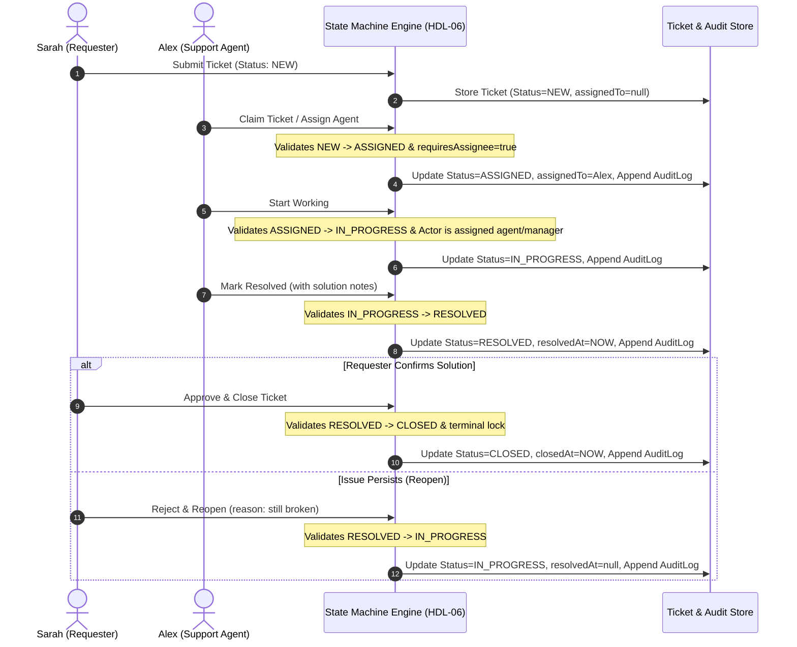

# HDL-06: Ticket State Machine & Lifecycle Engine Specification

## 1. System Overview & Objectives
The **HelpDesk Lite (V1 MVP)** Lifecycle Engine enforces strict state transitions, single-agent ownership, append-only audit tracking, and role-based permissions across support tickets.

```
       [+ NEW +]
           |
      (Assign Agent)
           v
     [ ASSIGNED ] <-----\
        |        |       | (Pause / Reassign)
(Start) |        |       |
        v        | (Unassign to pool)
  [ IN_PROGRESS ]-------/
        |
    (Resolve)
        v
    [ RESOLVED ] <-----\
        |              | (Reopen: Requester/Mgr)
 (Close)|--------------/
        v
    [[ CLOSED ]] (Immutable Terminal State)
```

---

## 2. State Transition Matrix

| From State | Allowed Target State | Required Actors | Invariants & Preconditions | Post-Conditions |
| :--- | :--- | :--- | :--- | :--- |
| `NEW` | `ASSIGNED` | `AGENT`, `MANAGER`, `SYSTEM` | `assignedToId` must be provided or agent self-claims. | Status becomes `ASSIGNED`, audit entry logged. |
| `ASSIGNED` | `IN_PROGRESS` | `AGENT`, `MANAGER` | Ticket must have non-null `assignedToId`. | Status becomes `IN_PROGRESS`. |
| `ASSIGNED` | `NEW` | `AGENT`, `MANAGER` | De-escalation or unassignment back to triage pool. | `assignedToId` reset to `null`. |
| `IN_PROGRESS` | `RESOLVED` | `AGENT`, `MANAGER` | Resolution summary provided. | `resolvedAt` set to ISO timestamp. |
| `IN_PROGRESS` | `ASSIGNED` | `AGENT`, `MANAGER` | Work halted (e.g. waiting for hardware/third-party). | Status reverts to `ASSIGNED`. |
| `RESOLVED` | `CLOSED` | `REQUESTER`, `MANAGER`, `SYSTEM` | Final verification of satisfactory fix. | `closedAt` timestamp set. Terminal lock engaged. |
| `RESOLVED` | `IN_PROGRESS`| `REQUESTER`, `MANAGER`, `AGENT` | Reopen ticket if defect persists. | `resolvedAt` timestamp reset to `null`. |
| `CLOSED` | *None* | *None* | Terminal state. No transitions allowed. | Throws `ImmutableStateError`. |

---

## 3. Sequence Diagram (Lifecycle & Audit Flow)



---

## 4. API Contract & Function Signatures

### Core Engine Function
```typescript
function transitionTicketState(
  ticket: Ticket,
  targetStatus: TicketStatus,
  actor: User,
  options?: TransitionOptions
): TransitionResult;
```

#### Inputs
- `ticket`: Read-only, immutable `Ticket` instance.
- `targetStatus`: One of `TicketStatus` (`NEW`, `ASSIGNED`, `IN_PROGRESS`, `RESOLVED`, `CLOSED`).
- `actor`: Current authenticated user `{ id, name, email, role }`.
- `options`:
  - `reason?: string`
  - `newAssignee?: { id: string; name: string } | null`
  - `metadata?: Record<string, unknown>`
  - `timestamp?: string`

#### Outputs (`TransitionResult`)
```typescript
interface TransitionResult {
  ticket: Ticket;          // Freshly allocated immutable copy with new status and updated auditLogs
  auditEntry: AuditLogEntry; // Newly appended audit log record
}
```

---

## 5. Domain Error Specification

| Error Class | Error Code | HTTP Equivalent | Trigger Scenario |
| :--- | :--- | :--- | :--- |
| `InvalidStateTransitionError` | `ERR_INVALID_STATE_TRANSITION` | 400 Bad Request | Skipping states (e.g. `NEW` -> `IN_PROGRESS` or `NEW` -> `RESOLVED`). |
| `UnauthorizedStateTransitionError` | `ERR_UNAUTHORIZED_TRANSITION` | 403 Forbidden | User role lacks permission for the transition (e.g. Requester assigning ticket). |
| `MissingAssigneeError` | `ERR_MISSING_ASSIGNEE` | 422 Unprocessable | Transitioning to `ASSIGNED` or `IN_PROGRESS` with null assignee. |
| `ImmutableStateError` | `ERR_IMMUTABLE_TERMINAL_STATE` | 409 Conflict | Attempting any state mutation or assignment on a `CLOSED` ticket. |

---

## 6. Frontend Hook Usage (`useTicketLifecycle`)

```tsx
import { useTicketLifecycle } from '@/hooks/useTicketLifecycle';
import { TicketStatus } from '@/types/ticket';

export function TicketActionPanel({ ticket, currentUser }) {
  const {
    ticket: currentTicket,
    availableNextStates,
    transitionTo,
    isTransitioning,
    lastError,
  } = useTicketLifecycle({
    initialTicket: ticket,
    currentUser,
    onTransitionSuccess: (updatedTicket, audit) => {
      console.log('Status updated:', updatedTicket.status, audit);
    },
  });

  return (
    <div>
      <p>Status: {currentTicket.status}</p>
      {lastError && <div className="text-red-600">{lastError.message}</div>}
      <div className="flex gap-2">
        {availableNextStates.map((status) => (
          <button
            key={status}
            disabled={isTransitioning}
            onClick={() => transitionTo(status)}
          >
            Move to {status}
          </button>
        ))}
      </div>
    </div>
  );
}
```
